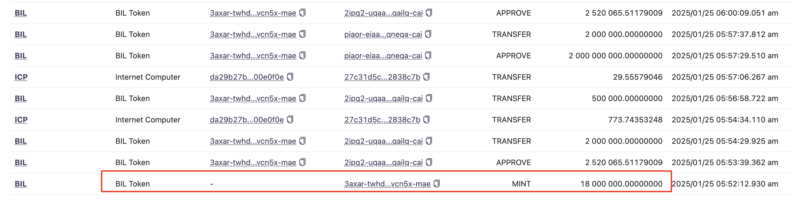
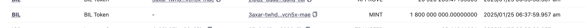

## BIL Incident explain

_TLDR_

A wallet minted over 2 billion BIL and sell all of those both in Kongswap and Icpswap

### The exploit

At 5 AM UTC he somehow made the function convert IBIL to BIL mint 2 billion tokens

And he dumped nearly all the LP in KongSwap and ICPSwap

### The buy back gone

Because community didn't know BIL got hacked, so some people buy back some BIL, they thought some whale might dump this token.

He minted more to dump these buy back

### Where the money gone

He convert all the ICP hacked to ckBTC and transfer to BTC network [tx detail](https://dashboard.internetcomputer.org/bitcoin/account/3axar-twhdo-biizl-yegt2-fatxq-go2ay-ib5ki-y6cmq-ziiav-vcn5x-mae)

All of the hacker swap order and ckBTC buy can see [here](https://www.icexplorer.io/address/detail/3axar-twhdo-biizl-yegt2-fatxq-go2ay-ib5ki-y6cmq-ziiav-vcn5x-mae)

### Where is the bug

I believed it because this line of [code](https://github.com/iancurtiss/BIL/blob/main/src/windoge_pow_backend/src/main.rs#L265)

Hacker tried to make the equation to be overflow which cause the number become too big
